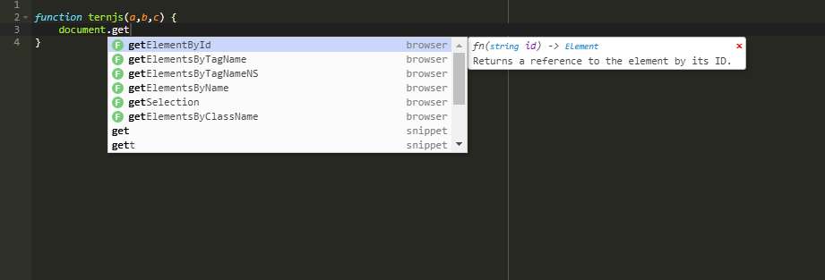

JSCFEditor
==

My personal continuation of [Tern.Ace](https://github.com/sevin7676/Ace.Tern).
Was made to become part of [JSCF](https://github.com/g--o/JSCFEditor)'s meta-editor.

*[Live Demo](https://g--o.github.io/JSCFEditor/src/)*

Changes made:
* Default local html
* Autocompletion + LiveAutocompletion out of the box
* Styling
* Bug fixes

